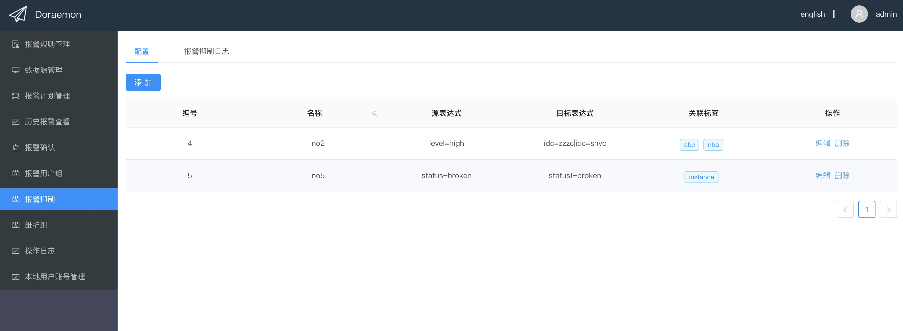
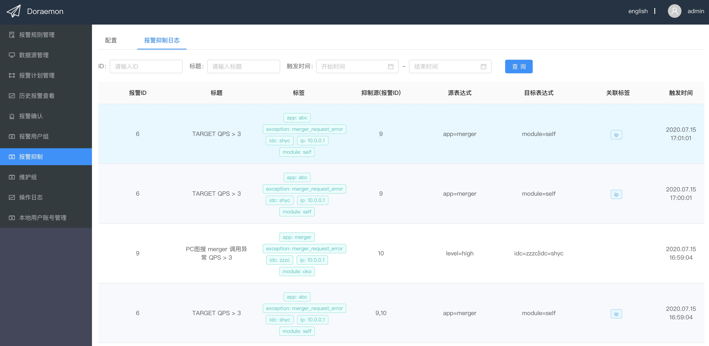

报警抑制的配置方式和AlertManager的 **[inhibit_rule](https://prometheus.io/docs/alerting/latest/configuration/)** 类似，但是可以在界面上动态配置，并且支持更为灵活的逻辑表达式。  
  
1. **添加报警抑制策略**  
  
每一个报警抑制策略包含名称、源表达式、目标表达式和关联标签几个选项，每项配置的解释如下：
    - 名称：该报警策略的名称
    - 源表达式：使用标签表达式来筛选出可以抑制其他报警的报警
    - 目标表达式：使用标签表达式来筛选出可以被满足"源表达式"的报警抑制的报警
    - 关联标签：满足源表达式的报警可以抑制满足目标表达式且关联标签值与其相同的报警（"关联标签"不是必填的）
    > 1.关于"标签表达式"见报警策略；2.报警无法自己抑制自己，但是两个报警（多个报警）可能相互抑制  
    
2. **报警抑制日志**  
  
在报警抑制日志中可以看到被抑制的报警的详细信息，每列的含义如下：
    - 报警ID：被抑制报警的ID
    - 标题：被抑制报警的标题
    - 标签：被抑制报警的标签
    - 抑制源：抑制该报警的报警ID
    - 源表达式：对应报警策略的源表达式
    - 目标表达式：对应报警策略的目标表达式
    - 关联标签：对应报警策略的关联标签
