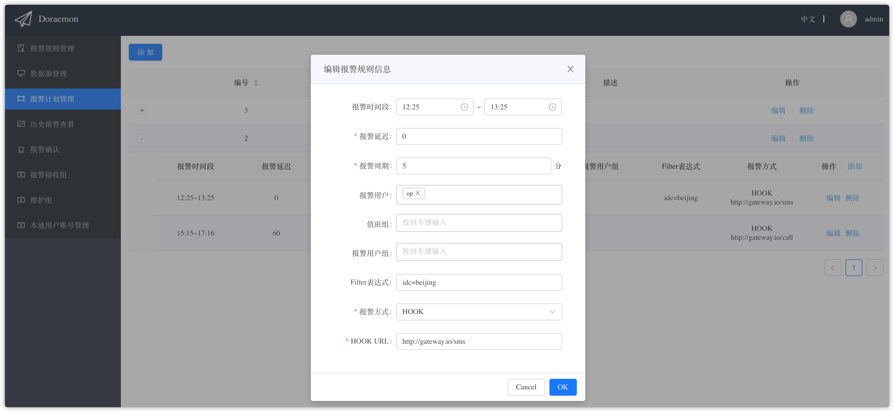

首先，添加报警计划。  
  
然后，给刚刚创建的报警计划添加报警策略。一个报警计划可以添加多个报警策略，通过这种方式，可以实现报警升级。  
  
为了创建报警策略，我们需要选择报警时间段，输入报警延时，报警周期，报警接收人（多个接收人之间以英文逗号分隔），报警接收组（多个接收组之间以英文逗号分隔），值班组（值班组的ID，多个值班组ID之间以逗号分隔），Filter表达式以及报警方式。  
  
1. **Filter表达式**  
Filter表达式用于根据标签来过滤报警，例如某个规则的报警信息中有idc这样一个标签，表示该报警来自哪个机房，如果某个运维人员只负责接收和处理北京机房的报警，他就可以使用idc=beijing这样一个Filter表达式（见上图），Filter表达式支持如下符号：
    - "="表示等于，例如：idc=beijing
    - "!="表示不等于，例如：idc!=beijing
    - "&"表示逻辑与，例如：idc=beijing&app=online
    - "|"表示逻辑或，例如：idc=beijing|app=online
    - "("，")"括号表示优先级，例如：(idc=beijing|app=online)&env=product  
需要注意的是标签的key和value中不能包含空格、Tab、=、!、&、|这几种特殊符号，并且当前版本只支持完全匹配。此外，如果某个报警的标签中不包含Filter表达式中的某个标签，则直接判定为匹配失败，不会发送报警。如果希望接收某条规则的全部报警，则不需要填写Filter表达式。
2. **使用HOOK方式发送报警**  
    - 对于HOOK方式，报警以及报警恢复信息会以HTTP POST请求的方式发送至目标服务器（JSON格式），其中报警信息内容如下：  
        ```json
        {
            "type": "alert",                                                 
            "time": "2020-02-28 15:27:00",                                   
            "rule_id": 296,                                                  
            "to": ["Tom", "Lee", "Jerry"],                                   
            "confirm_link": "http://domainname/alerts_confirm/296?start=1",  
            "alerts": [{                                                                                                                
                "id": 20163,                                                     
                "count": 14645,                                                  
                "value": 76.58,                                             
                "summary": "map_req",                                        
                "hostname": "10.0.0.1",
                "labels":{
                    "app":"sony",
                    "idc":"beijing",
                    "module":"doraemon"
                }
            }, {
                "id": 67803,
                "count": 13,
                "value": 74.75,
                "summary": "map_req",
                "hostname": "10.0.0.2",
                "labels":{
                    "app":"bison",
                    "idc":"shanghai",
                    "module":"doraemon"
                }
            }, {
                "id": 67806,
                "count": 12,
                "value": 81.83,
                "summary": "map_req",
                "hostname": "10.0.0.3",
                "labels":{
                    "app":"one",
                    "idc":"guangzhou",
                    "module":"doraemon"
                }
            }]
        }
        ```  
        "type"是报警的类型（"alert"表示报警信息，"recover"表示报警恢复信息），"time"是报警发出的时间，"rule_id"是报警对应的Rule的Id，"to"是报警接收人（会自动将报警接收组中的人加入其中），"confirm_link"是报警确认链接，"alerts"是经过聚合的报警，"id"是该报警记录的Id，"count"是报警时长（单位：分钟），"value"是报警的当前值，"summary"报警的概述，"hostname"是主机名。报警恢复信息内容如下：
        ```json
        {
            "type": "recover",                                                 
            "time": "2020-02-28 15:27:00",                                   
            "rule_id": 296,                                                  
            "to": ["Tom", "Lee", "Jerry"],                                   
            "alerts": [{                                                                                                                
                "id": 20163,                                                     
                "count": 14645,                                                  
                "value": 76.58,                                             
                "summary": "map_req",                                        
                "hostname": "10.0.0.1",
                "labels":{
                    "app":"sony",
                    "idc":"beijing",
                    "module":"doraemon"
                }
            }, {
                "id": 67803,
                "count": 13,
                "value": 74.75,
                "summary": "map_req",
                "hostname": "10.0.0.2",
                "labels":{
                    "app":"bison",
                    "idc":"shanghai",
                    "module":"doraemon"
                }
            }, {
                "id": 67806,
                "count": 12,
                "value": 81.83,
                "summary": "map_req",
                "hostname": "10.0.0.3",
                "labels":{
                    "app":"one",
                    "idc":"guangzhou",
                    "module":"doraemon"
                }
            }]
        }
        ```  
        在报警恢复信息中没有"confirm_link"字段，其他内容和报警信息一样。  
         
    - 使用HOOK方式也可以实现自定义的报警升级功能。假设用户有自己的信息发送网关（ http://gateway.io ），其中短信网关的url为 http://gateway.io/sms ，电话网关url为 http://gateway.io/call 。用户希望当报警持续不足1小时使用短信报警发送给运维人员，如果报警时长超过一小时则以电话的方式通知运维leader，则可以进行如下配置：  
        
      
3. **值班组**  
    对于值班组，Doraemon会根据 **[配置文件](ConfigurationItemDescription-CN.md)** 中的DutyGroupUrl，向目标服务器发起一个HTTP GET请求来获取值班组成员，即 http://DutyGroupUrl?teamId=1&day=2020-02-21 ，其中teamId为值班组Id，day是当天的日期，目标服务器需要返回如下JSON格式的信息（account是值班用户名）。
    ```json
    {
        "data": [{
            "account": "jay"
        }, {
            "account": "tank"
        }]
    }
    ```
