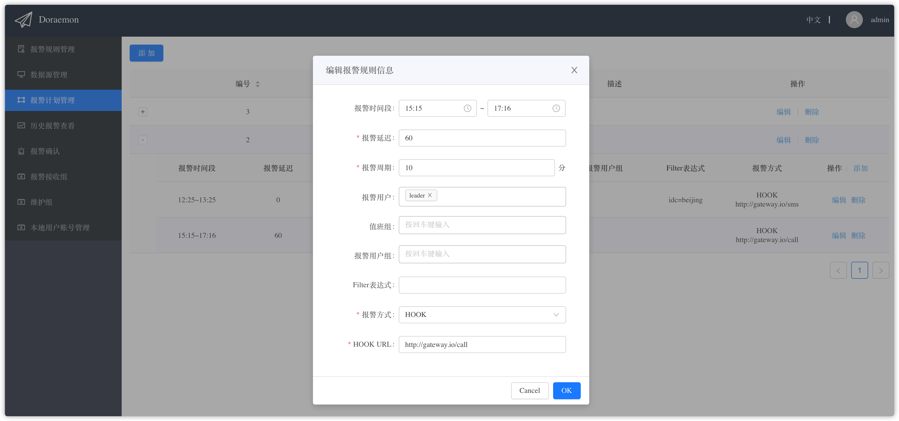

At first,add the alarm plan.


And then add strategies of that alarm plan just created.One can add more then one strategy for each alarm plan,which can realize alarm upgrade strategy.


To create a alarm strategy,we must choose the alarm period,fill in the alarm delays,alarm period,the receivers(multiple receivers are separated by commas),duty groups(the ID of duty group and multiple value team IDs are separated by commas),alarm groups(multiple alarm groups are separated by commas),Filter expression and the alarm method.

  

1. **Filter Expression**

Filter expression is used to filter alarms according to labels.

For example,a label such as idc in a rule's alarm information indicates which computer room the alarm comes from.If an operation and maintenance personnel is only responsible for receiving and processing alarms in Beijing computer room,then he can use a filter expression such as idc=beijing(see the above figure).

Filter expression supports the following symbols:
- `=` means equal to, for example,`idc=beijing`
- `!=` means not equal to, for example,`idc!=beijing`
- `&` represents logical AND, for example,`idc=beijing&app=online`
- `|` represents logical OR, for example,`idc=beijing|app=online`
- `("，")` parentheses denote priority,for example,`(idc=beijing|app=online)&env=product`  

It is important to note that the key and value of the tag cannot contain the following special symbols,i.e,`spaces`,`tabs`,`=`,`!`,`&`,`|`.
Besides,the current version of Filter Expression only supports exact matching.If the labels of an alarm do not contain the labels in the Filter Expression,it is directly determined that the matching fails and the alarm will not be sent.If you want to receive all the alarms of a rule,you do not need to fill in the Filter Expression.

2. **Send Alarm by HOOK**

- For users who use HOOK to send alarms and alarm recovery information,which will be sent to target server through HTTP post request (JSON format).The format of alarms sent by HOOK is as follow:

```json
{
    "type": "alert",
    "time": "2020-02-28 15:27:00",
    "rule_id": 296,
    "to": ["Tom", "Lee", "Jerry"],
    "confirm_link": "http://domainname/alerts_confirm/296?start=1",
    "alerts": [{
        "id": 20163,
        "count": 14645,
        "value": 76.58,
        "summary": "map_req",
        "hostname": "10.0.0.1"
    }, {
        "id": 67803,
        "count": 13,
        "value": 74.75,
        "summary": "map_req",
        "hostname": "10.0.0.2"
    }, {
        "id": 67806,
        "count": 12,
        "value": 81.83,
        "summary": "map_req",
        "hostname": "10.0.0.3"
    }]
}
```

        "type" refers to the type of information ("alert" refers to the alarm information; "recover" refers to the alarm recovery information)."time" refers to the time when the alarm is sent."rule\_id" refers to the ID of the rule corresponding to the alarm."to" refers to the alarm receivers (the person in the alarm receive group will be added automatically)."confirm_link" refers to the alarm confirm link."alerts" refers to the aggregated alarms."Id" refers to the ID of the alarm record."Count" is the alarm duration (in minutes)."value" is the current value of the alarm."summary" is the summary of the alarm."hostname" is the hostname of alarm host.The format of alarm recovery information sent by HOOK is as follow:  
        ```json
        {
            "type": "recover",                                                 
            "time": "2020-02-28 15:27:00",                                   
            "rule_id": 296,                                                  
            "to": ["Tom", "Lee", "Jerry"],                                   
            "alerts": [{                                                                                                                
                "id": 20163,                                                     
                "count": 14645,                                                  
                "value": 76.58,                                             
                "summary": "map_req",                                        
                "hostname": "10.0.0.1"                                 
            }, {
                "id": 67803,
                "count": 13,
                "value": 74.75,
                "summary": "map_req",
                "hostname": "10.0.0.2"
            }, {
                "id": 67806,
                "count": 12,
                "value": 81.83,
                "summary": "map_req",
                "hostname": "10.0.0.3"
            }]
        }
        ```  
        There is no "confirm_link" field in the alarm recovery information.The other contents are the same as the alarm information.  
             
    - The use of hook mode can also realize the custom alarm upgrade function.Suppose that users have their own information sending gateway (http://gateway.io) ,the URL of SMS gateway of which is http://gateway.io/sms and the URL of telephone gateway of which is http://gateway.io/call .The user hopes that when the alarms lasts less than 1 hour, the SMS alarms will be sent to the operation and maintenance personnel,and if the alarm lasts more than 1 hour, the operation and maintenance leader will be informed by phone.Then,they can configure the alarm strategies as follows:  
      
    
    
3. **The Duty Group** 
    - For the duty group,Doraemon will send an HTTP GET request to the target server according to the DutyGroupUrl in the **[configuration file](ConfigurationItemDescription.md)** to get the group members,that is, http://DutyGroupUrl?Teamid=1&day=2020-02-21 ,where Teamid is the group's ID and day is the date of the day.Then,the target server needs to return the following JSON format information(account is the user who is on duty):
        ```json
        {
            "data": [{
                "account": "jay"
            }, {
                "account": "tank"
            }]
        }
        ```
